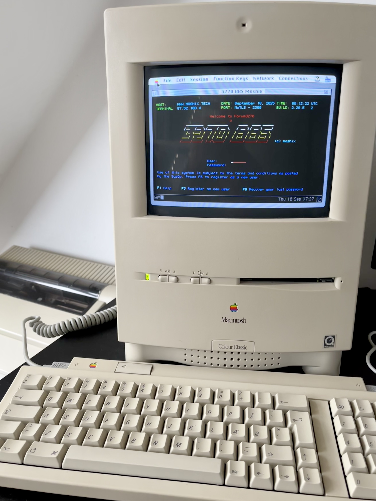
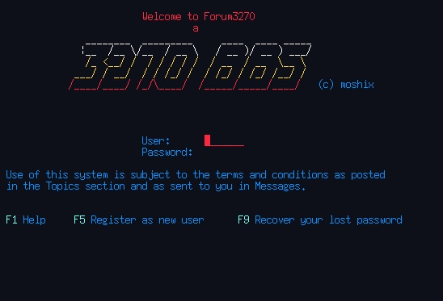

# A 3270 BBS



This is the same code that runs [my Forum3270 BBS](https://www.moshix.tech:3270) for IBM 3270 terminals, [real](https://youtube.com/shorts/deyGhLtKzp8?si=_f4SYaz37xLR54Zj) and emulated.

Just to make it clear, this BBS needs for acces with an **IBM 3270 terminal emulator**, not Putty, or telnet.

## Table of Contents

- [Overview](#overview)
- [Public 3270BBS Servers](#public-3270bbs-servers)
- [Requirements](#requirements)
- [Platform Support](#platform-support)
- [Features](#features)
- [Installation](#installation)
- [Configuration](#configuration)
  - [Basic Configuration](#basic-configuration)
  - [TLS Terminal Access](#tls-terminal-access)
  - [SSH Access](#ssh-access)
  - [Federated Chat](#federated-chat)
- [Operation](#operation)
  - [Content Editing](#content-editing)
  - [User and Content Management](#user-and-content-management)
  - [Admin Panels](#admin-only-panels)
  - [SDSF Commands](#sdsf-commands)
- [Proxying to Another Mainframe](#proxying-to-another-mainframe)
- [Backup Strategy](#backup-strategy)
- [Technical Details](#technical-implementation-details)
- [Roadmap](#roadmap)
- [License and Disclaimer](#final-notes)

## Overview

3270BBS is an extremely efficient bulletin board system designed for IBM 3270 terminals. It uses minimal resources - supporting up to 50 concurrent users with only 25MB of memory, and has handled 150+ concurrent users with just 64MB. All data is stored in an SQLite3 database (automatically converted to WAL mode), and after six months of heavy activity with hundreds of users, the database remains under 50MB.

The system is heavily multi-threaded, making it blazing fast even on single-core systems, though more cores improve performance. It runs perfectly on small servers like Raspberry Pi or basic VPS instances, and particularly loves Linux/s390x.

## Public 3270BBS Servers

| BBS Name            | SysOp     | URL                        | Port |
|---------------------|-----------|----------------------------|------|
| Forum3270           | moshix    | www.moshix.tech            | 2300 |
| Ernietech's 3270BBS | Ernietech | ernietech.net              | 3270 |
| SpanishBBS          | turboss   | jauriarts.org              | 3270 |
| RevertPulse         | kurisu    | bbs.revertivepulse.net     | 3270 |
| tqw3270 BBS         | MeaTMaN   | bbs.erb.pw                 | 3270 |

## Requirements

- **sqlite3** installed on your system
- An IBM 3270 terminal emulator (c3270, x3270, or [Vista3270](https://www.tombrennansoftware.com/))
- **No Go compiler required** - the binary is static and self-contained

## Platform Support

| Binary              | Supported          |
|---------------------|--------------------|
| Linux 64amd         | :white_check_mark: |
| Linux i386 (32bit)  | :white_check_mark: |
| Linux 64arm         | :white_check_mark: |
| Linux s390x         | :white_check_mark: |
| FreeBSD             | :white_check_mark: |
| macOS Universal     | :white_check_mark: |
| Windows             | :x:                |
| Is it awesome?      | :white_check_mark: |

## Features

| Feature                                          | Included           |
|--------------------------------------------------|--------------------|
| Virtual sessions mgmt with F23/F24              | :white_check_mark: |
| Discussion groups                                | :white_check_mark: |
| Federation of chat                               | :white_check_mark: |
| Conferences and conference mgmt by moderators    | :white_check_mark: |
| Moderators can ban users from conferences        | :white_check_mark: |
| I Like for topics                                | :white_check_mark: |
| Messages                                         | :white_check_mark: |
| Calendar                                         | :white_check_mark: |
| Live Chat                                        | :white_check_mark: |
| Private chat                                     | :white_check_mark: |
| Marketplace                                      | :white_check_mark: |
| User rolodex                                     | :white_check_mark: |
| About me page thru PUBLIC note                   | :white_check_mark: |
| User management                                  | :white_check_mark: |
| Admin panels                                     | :white_check_mark: |
| Session management                               | :white_check_mark: |
| DB creation script                               | :white_check_mark: |
| Sqlite3 and PostgreSQL support                   | :white_check_mark: |
| FTP Server for notes access                      | :white_check_mark: |
| Web Server for notes, topics, sysadmin access    | :white_check_mark: |
| Console                                          | :white_check_mark: |
| SDSF activity panel                              | :white_check_mark: |
| Updating clock with seeing eye and IBM logo      | :white_check_mark: |
| Hot air balloon game                             | :white_check_mark: |
| Blackjack game                                   | :white_check_mark: |
| Wordle in English/Italian/German                 | :white_check_mark: |
| TSO command line with several utilities          | :white_check_mark: |
| Log viewer                                       | :white_check_mark: |
| TLS and TN3270 listeners                         | :white_check_mark: |
| FTPD server and HTTPD server                     | :white_check_mark: |
| Console view                                     | :white_check_mark: |
| Forex updated table                              | :white_check_mark: |
| Stocks quotron screen                            | :white_check_mark: |
| All Seeing Eye from clock view                   | :white_check_mark: |
| TLS and SSL support with certificates            | :white_check_mark: |
| SSH access to chat and topics                    | :white_check_mark: |
| Screensaver to protect from burn-in              | :white_check_mark: |
| DELTAMON performance monitor                     | :white_check_mark: |
| Doors to other 3270BBS communities               | :white_check_mark: |
| Discord access to Mainframe Enthusiasts Channel  | :white_check_mark: |
| The Matrix in the raw                            | :white_check_mark: |
| Time skew detection compared to NTP              | :white_check_mark: |
| No database server needed                        | :white_check_mark: |
| SHA256 password hashing for all accounts         | :white_check_mark: |
| Account enumeration protection                   | :white_check_mark: |
| Regular security audits by outside firm          | :white_check_mark: |
| No root privileges required                      | :white_check_mark: |
| SysOp-definable, dynamic logon screen logo       | :white_check_mark: |
| Support Sqlite3 and Postgres                     | :white_check_mark: |
| Print by PDF to email                            | :white_check_mark: |

## Installation

Choose either the fast Docker method or DIY installation:

### Docker Installation

Use Harding's [dockerized 3270BBS](https://github.com/MortenHarding/docker-3270BBS)

### Manual Installation

1. Download the [binary for your platform](https://github.com/moshix/3270BBS/releases/tag/26.7) and **rename it to 3270bbs**

2. **Run the create_tsudb.sh script** to create tsu.db with default users:
   - `admin/admin` - Administrative account (change password immediately)
   - `noreply/noreply` - Internal system messages account

3. Edit the sample `tsu.greet` file (greeting for new users, max 80 characters wide)

4. Start the BBS using the provided `start_bbs.bash` script (recommend logging output to a file)

5. Announce your new BBS and consider submitting it to be listed in the Public Servers section

For installation questions, reach out to moshix on Forum3270.

## Configuration

### Basic Configuration

Create a `tsu.cnf` file (required for startup). Here's an example configuration, which by default
assumes a sqlite3 database:

```
# Server settings
# (c) 2025 by Moshix. All rights reserved.
# bbs_name is the name of your BBS, up to 10 characters wide only!
bbs_name=My3270BBS

# if you define dns_name then this is what will be shown in your logon screen,
# and DNS reverse lookup will not be used.
# this is useful if you are behind NAT such as in cloud service
dns_name=www.moshix.tech 

MOTD="Welcome to my 3270 BBS"

# 3270 ports
port=3270                  # port for non-encrypted traffic
tlsport=3271               # port for TLS 1.x encrypted traffic

# start TLS port?
start_TLS=yes

# your certificate
tlscert=your.crt
tlskey=your.key

#sendgrid API key
# add your sendgrid API key if you have one to allow your users to print by PDF to their email address
# configured in their profile
SENDGRID_API_KEY="123"
# notify admin user of new accounts?
notify_admin_new_accounts=yes

# these conferences cannot be unsubscirbed
required_conferences="General","3270BBS","User content"

# web server port
httpd_port=9000            # port for the HTTPD listener

# FTP server settings
FTP_port=2100              # Port for FTP server (default: 2100)
FTP_limit=20               # Maximum file size in KB (default: 20)
start_FTPD=no

# other servers
start_proxy3270=yes
start_HTTPD=yes

# ssh server settings
start_SSHD=yes
sshd_port=2022

# remote mainframe settings for v27.0 and up
# Up to 15 can be configured.
# The remote hosts are being read in dynamically at runtime
# So you can make changes to the tsu.cnf file for remote hosts without needing to restart the BBS
remote1=Forum3270
remote1_description="moshix Forum3270"
remote1_addr=www.moshix.tech
remote1_port=2300

remote2=SDFVM
remote2_description="VM/SP rel5 with PROFS at SDF"
remote2_addr=sdfvm.sdf.org
remote2_port=24

remote3=Secureproxy3270
remote3_description="Some other mainframe"
remote3_addr=9.9.1.1       # IPv6 also works!
remote3_port=3270
```

**Custom Logo:** Customize `tsu.logo` for your logon screen (only first 8 lines used)

**Required Conferences:** To prevent users from unsubscribing from certain conferences, add to tsu.cnf:
```
required_conferences="General","3270BBS","User content"
```

### TLS Terminal Access

For secure TLS access, you'll need certificates specified in tsu.cnf with the `tlscert` and `tlskey` parameters.

### SSH Access

Configure the SSHD port in tsu.cnf. Users must be registered to use SSH access, using the same password as 3270 access. SSH mode provides limited features (chat and topics) as this is primarily a 3270 BBS.

### Federated Chat

3270BBS instances can participate in federated worldwide chat. Operators must contact moshix for credentials and configuration. Good standing in Forum3270 is required.

## Operation

### Content Editing

3270BBS includes a built-in editor for Topics, Posts, Notes, marketplace items, and Messages. The editor features a spell checker enhanced with mainframe terminology (JCL, ABEND, etc.).

**Rendering Tags:**
Messages and topics support color tags (best placed on their own lines):
- `<<blue>>`, `<<white>>`, `<<red>>`, `<<pink>>`, `<<green>>`, `<<yellow>>`, `<<turquoise>>`
- `<<reverse>>` and `<</reverse>>`

**Editor Function Keys:**
```
F1  = Scroll to first line
F2  = Spell checker
F4  = Delete current line
F5  = Insert line below
F6  = Insert line above
F7  = Scroll up
F8  = Scroll down
F9  = Scroll to last line
F10 = Center current line
F11 = Make centered box
F13 = Make centered box until next empty row
F14 = Abandon edit session
F15 = Save and exit
SAVE   = Save content
CANCEL = Exit editor unsaved
```

### User and Content Management

**Key Functions:**
- **F1** - Help screen
- **F23** - Create new virtual session
- **F24** - Switch between virtual sessions (max 2)

**Daily Maintenance:**
The BBS is very stable and can run for months, but requires regular content moderation. Daily pruning is easier than periodic mass cleanup. Use `remove_old_users.bash` to prune inactive users (removes users but preserves their posts/topics).

**User Tools:**
- Users can delete their own accounts from the Edit Profile option (0) in main menu
- Password recovery available via PF9 from logon panel
- `insert_to_dictionary.bash` - Add words to spell checker dictionary
- `import_calendar.sh` - Import .ics files to individual calendars

**FTP/HTTP Access:**
If enabled, users can upload/download notes directly, allowing external editing of longer content. Notes can be converted to posts with a single function key.

### Admin Only Panels

- LOG command from main menu
- F4 from SDSF
- Start/stop components from MVS Console in Extended Menu

### SDSF Commands

Admins can issue these commands from the SDSF Activity screen:

```
P FTPD              - Stop the FTPD server
S FTPD              - Start the FTPD server
P PROXY             - Stop the PROXY server
S PROXY             - Start the PROXY server
P HTTPD             - Stop the HTTPD server
S HTTPD             - Start the HTTPD server
P TN3270TLS         - Stop the TLS listener
S TN3270TLS         - Start the TLS listener
P TN3270            - Stop the TN3270 listener
S TN3270            - Start the TN3270 listener

C U=MOSHIX          - Terminate session of user MOSHIX
$PJES2,TERM         - Terminate the BBS gracefully
LOG                 - View BBS log (F7/F8 navigate, TOP/BOT for extremes)
```

Additional admin panels for Users, Topics, and Posts management are also available.

## Proxying to Another Mainframe

3270BBS can proxy users to other mainframes configured in tsu.cnf (enable PROXY server in config or from SDSF). The remote system can be another 3270BBS instance or any mainframe.

**Return to BBS:** Press **PA3** attention key in your terminal emulator.

## Backup Strategy

Since the SQLite3 database runs in WAL mode, you cannot simply copy tsu.db. Instead, dump the database regularly to .sql files:

```bash
# Example backup command
sqlite3 tsu.db .dump > backup_$(date +%Y%m%d).sql
```

## Technical Implementation Details

The application consists of roughly 40,000 lines of Go code. The most complex component is the real-time chat system, which is heavily multi-threaded. For implementation details, see [this documentation](https://github.com/moshix/BITNETServices/blob/master/forum3270_chat.md).

Built using the [go3270](https://github.com/racingmars/go3270) library by **racingmars**.

## Roadmap

**User Web Pages:** If the web server is enabled and a user has a Note called **Public**, its content will be displayed at `http://3270bbswebsite/username`

**Future Plans:**
- Full source code release after bug reports and security audits
- Easter eggs to be discovered by the community

## Final Notes

This BBS application is made available in binary form only, strictly as is. It is provided without warranties of any kind, either express or implied, including, but not limited to, the implied warranties of merchantability and fitness for a particular purpose.

The developers assume no responsibility or liability for any direct, indirect, incidental, or consequential damages that may result from the use, misuse, or inability to use this software. You are using this application at your own risk.

No technical support, updates, or maintenance releases are guaranteed. However, feedback and bug reports may be submitted through the appropriate community channels, and while not promised, improvements may be considered in future builds.

By using this software, you agree to abide by any applicable local, national, or international laws regarding software usage and telecommunications. Unauthorized modification, reverse engineering, or redistribution is strictly prohibited unless explicitly permitted by the license or author.



---

**Moshix, October 13, 2025 - Milan**
